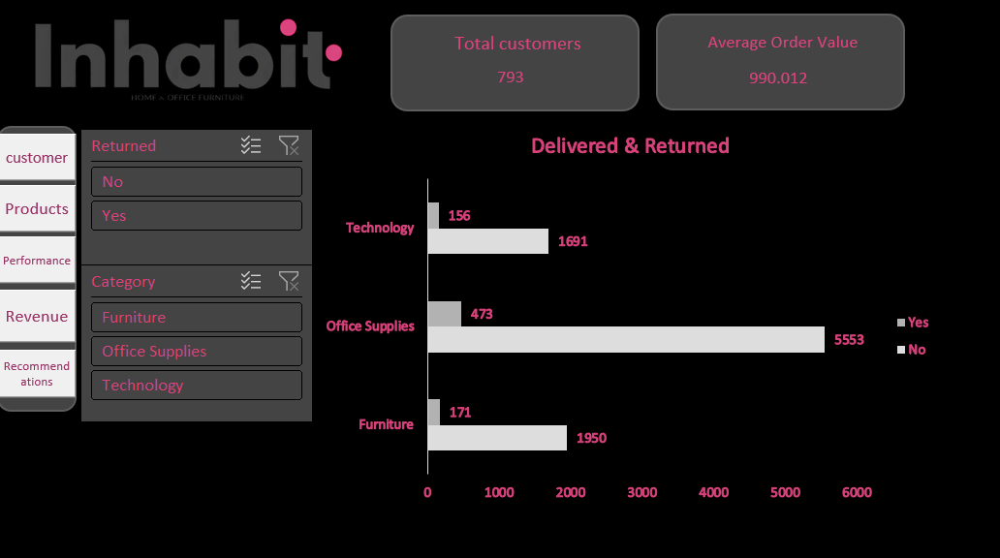
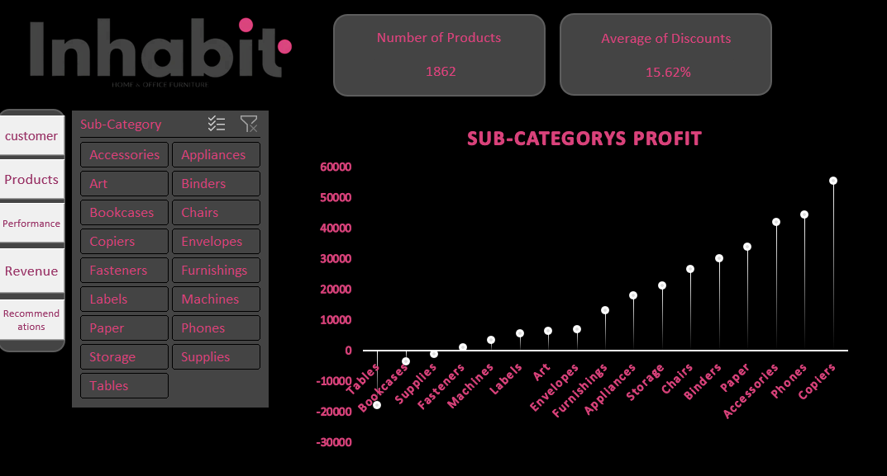
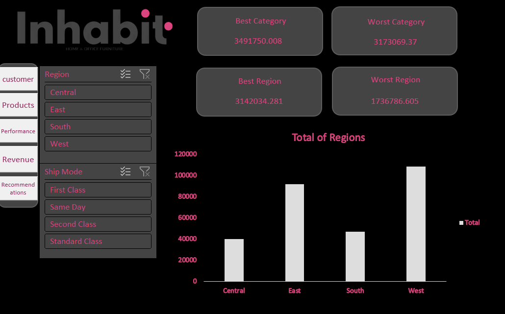
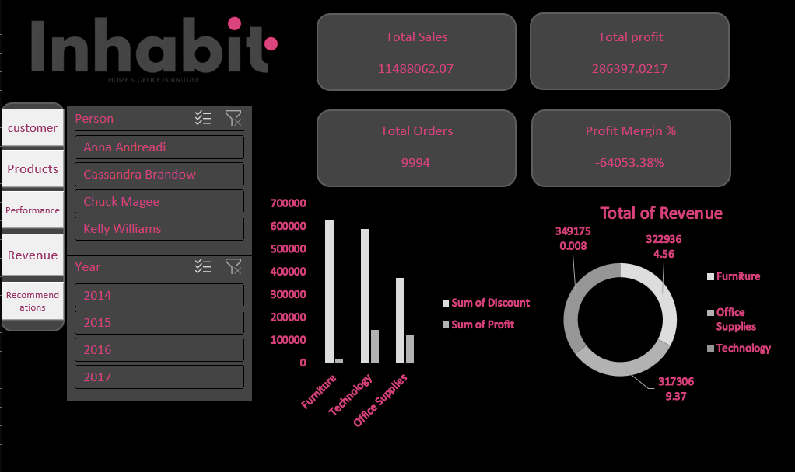
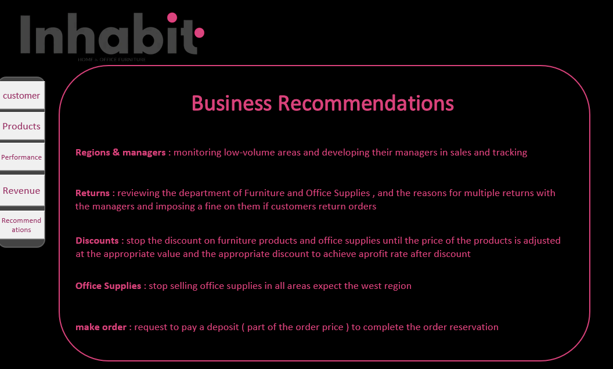

# Inhabit — Excel Sales Dashboard

An interactive sales dashboard built entirely in **Excel (.xlsm)**, using the well-known Superstore dataset. It includes Pivot Tables, Slicers, Charts, and VBA-powered navigation buttons to switch between analysis views.

## Data Overview

| Item | Value |
|---|---|
| Orders | 9,994 rows |
| Time span | 2014 – 2017 |
| Total Sales | ~$11.49M |
| Total Profit | ~$286K |
| Categories | Furniture, Office Supplies, Technology |
| Regions | East, West, Central, South |

## Workbook Structure (Sheets)

| Sheet | Description |
|---|---|
| `Orders` | Raw order-level data (order/ship date, customer, product, sales, discount, profit, etc.) |
| `Mangers` | Lookup table mapping each Region to its sales Person |
| `Returns` | List of returned orders (Order ID) |
| `Customers` | Customer analysis dashboard (Pivot + Charts) |
| `Products` | Product/category analysis dashboard (Pivot + Charts) |
| `Performance` | Overall performance metrics dashboard |
| `Revenue` | Revenue analysis dashboard |
| `Recommendations` | Recommendations / summary of findings |
| `Sheet1` | Workspace for helper Pivot Tables |

## Technical Features

- **Pivot Tables**: 12 pivot tables feeding the charts and analyses across sheets.
- **Slicers**: Interactive filters (by Region, Category, Year, etc.) linked to multiple pivots at once.
- **Charts**: Ready-made visuals for each dashboard (sales, profit, category breakdown...).
- **VBA Macros**: Quick-navigation buttons that jump between the `Products`, `Performance`, `Revenue`, `Recommendations`, and `Customers` sheets instead of clicking tabs manually.

## How to Use

1. Download `Inhabit.xlsm` and open it in **Microsoft Excel** (2016 or later recommended for full Slicer/Pivot support).
2. On opening, click **Enable Content / Enable Macros** so the navigation buttons work.
3. Use the buttons or sheet tabs to move between the `Customers`, `Products`, `Performance`, `Revenue`, and `Recommendations` dashboards.
4. Use the Slicers to filter by Region/Category/Year and see the charts and tables update instantly.

## Requirements

- Desktop Microsoft Excel — the file relies on VBA and Pivot/Slicers, which aren't fully supported in Excel Online or Google Sheets.
- Macros must be enabled on open.

## Data Schema (key `Orders` columns)

`Order ID`, `Order Date`, `Ship Date`, `Ship Mode`, `Customer Name`, `Segment`, `Region`, `State`, `City`, `Category`, `Sub-Category`, `Product Name`, `Sales`, `Quantity`, `Discount`, `Profit`, `Returned`

## 📷 Preview

### customers

### Products

### performance

### Revenue

### Recommendations

---

## Author
**Thomas Wagdy** — Data Analyst

- GitHub: [ThomasWagdy](https://github.com/ThomasWagdy)
- LinkedIn: [thomas-wagdy](https://www.linkedin.com/in/thomas-wagdy-2355653b3/)

## License

Add a `LICENSE` file (e.g. MIT) if you plan to publish this as an open-source project.
